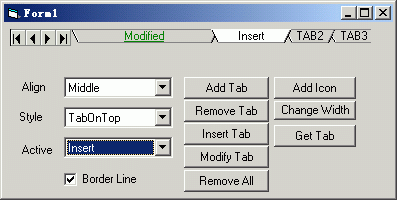



## myTab by progame

### Description

My tab control like tabs in Excel.

You can add/remove/edit any tab by index or key.

Custom any color,different effect when mouse hover.

raise events:

mousemove,tabchange,click,dblclick,selectchange,hover.

enjoy it :-)
 
### More Info
 

             |
---                |---
**Submitted On**   |2002-07-01 10:07:54
**By**             |[progame](https://github.com/Planet-Source-Code/PSCIndex/blob/master/ByAuthor/progame.md)
**Level**          |Advanced
**User Rating**    |5.0 (10 globes from 2 users)
**Compatibility**  |VB 5\.0, VB 6\.0
**Category**       |[Custom Controls/ Forms/  Menus](https://github.com/Planet-Source-Code/PSCIndex/blob/master/ByCategory/custom-controls-forms-menus__1-4.md)
**World**          |[Visual Basic](https://github.com/Planet-Source-Code/PSCIndex/blob/master/ByWorld/visual-basic.md)
**Archive File**   |[myTab\_by\_p1004216302002\.zip](https://github.com/Planet-Source-Code/progame-mytab-by-progame__1-36418/archive/master.zip)

